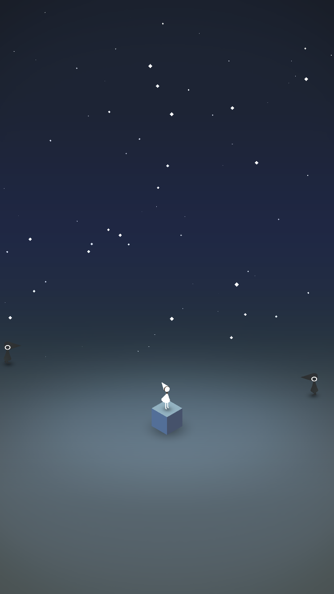
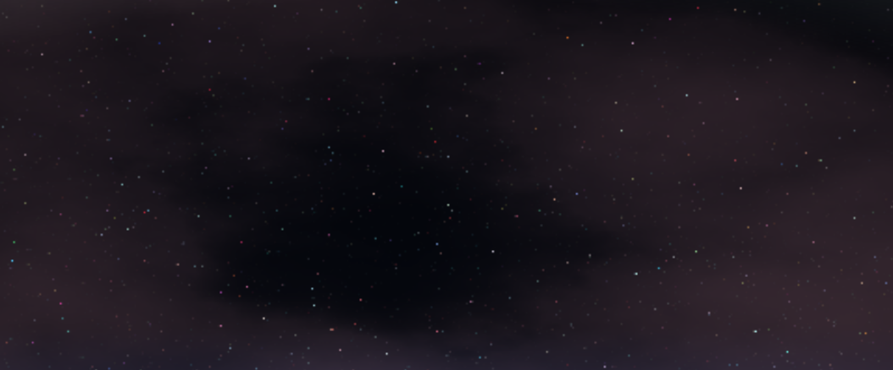

# environment setpiece 
by Annie Su, anniesu1

## Inspiration
I recently finished the game Monument Valley on my phone. I loved the visuals and pseudo-3d/2d world that the game was set in and 
thought it would be interesting to hybridize the 2d and 3d look of the game. 

## Implementation and features
- Geometry: the geometry of the central figure and the surrounding octahedrons are made using signed distance functions. 
- Shading: all shapes have shading applied to them based off the blinn-phong reflection model. 
- Animation: the stars flicker in and out based on a basic 2d noise function which determines both their 
presence and color. The clouds are made using a perlin-based fractal brownian motion that takes in the position and also
a time component to give the clouds movement. The prisms surrounding the main character are animated using a triangle wave
function that takes in a time variable and displaces the y-coordinate of the pixel position.
- Lighting: I have 3 lights in the scene: 1 directly above in the center of the scene, one located to the right, and an ambient light as well to give more illumination to the scene.
- Vignette: I applied a vignette to the scene by calculating each pixel's distance from the center, and scaling the color by (1-distance)

- Sky - color remapping: I remapped colors in the sky and linearly interpolated between a set of 5 colors to produce a gradient 
effect. The color palette is inspired from pictures of night-time skies. 

## External Resources
- Read about SDF's and referenced intersection, union, and differrence SDF functions from [here](http://jamie-wong.com/2016/07/15/ray-marching-signed-distance-functions/#surface-normals-and-lighting)
- Referenced blinn-phong lighting method from [here](https://www.shadertoy.com/view/Xtd3z7)
- Learned about SDF's from [this blog post](http://www.iquilezles.org/www/articles/distfunctions/distfunctions.html)
- Referenced multiple SDF functions for basic primitives from [here](https://www.shadertoy.com/view/Xds3zN)
- Followed CIS-460 lectures slides for ray casting implementation from [here](https://docs.google.com/presentation/d/e/2PACX-1vSN5ntJISgdOXOSNyoHimSVKblnPnL-Nywd6aRPI-XPucX9CeqzIEGTjFTwvmjYUgCglTqgvyP1CpxZ/pub?start=false&loop=false&delayms=60000&slide=id.g27215b64c6_0_107)
- Read about Bounding Volume Hierarchies [here](https://www.scratchapixel.com/lessons/advanced-rendering/introduction-acceleration-structure/bounding-volume)
- Referenced ray-box intersection implementation from [here](https://www.scratchapixel.com/lessons/3d-basic-rendering/minimal-ray-tracer-rendering-simple-shapes/ray-box-intersection)
- Referenced Toolbox Functions slides for triangle wave implementation
- Referenced IQ's shadertoy for basic shader set-up/structure [here](https://www.shadertoy.com/view/4tByz3)

## Link to github.io Demo
https://anniesu1.github.io/environment-setpiece/
